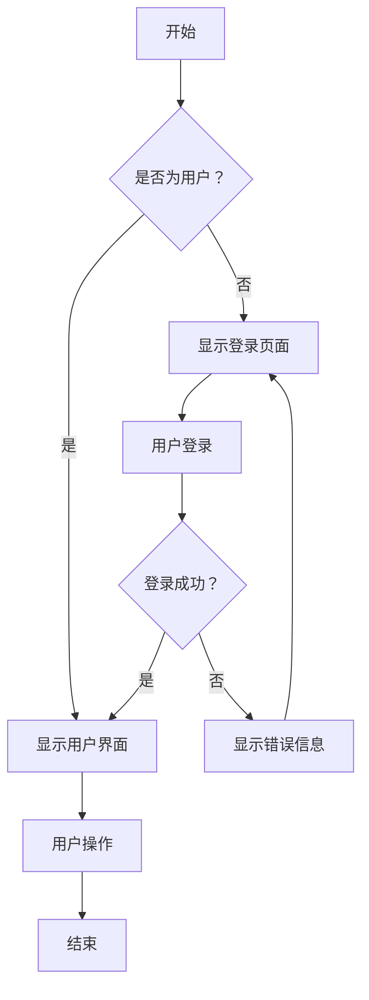
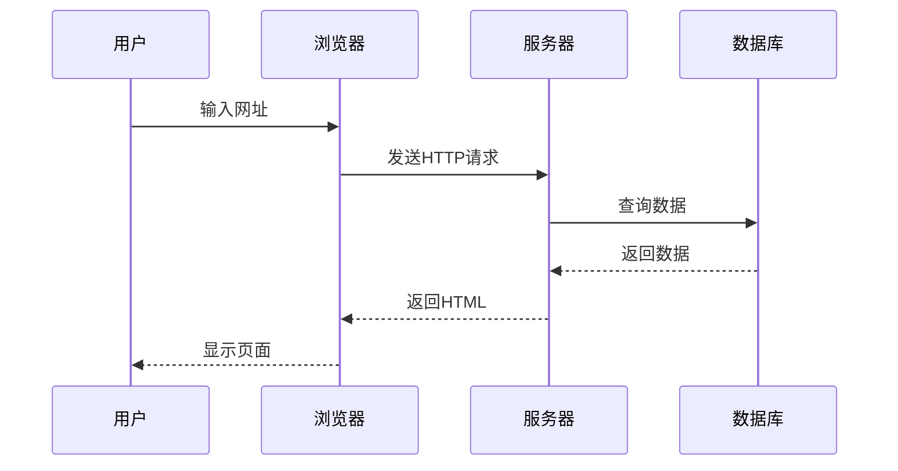
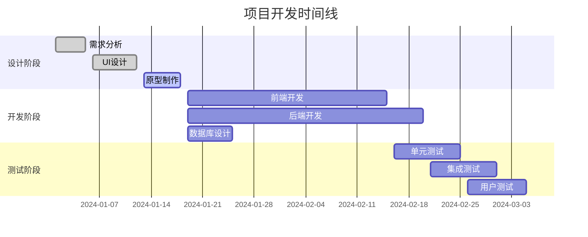
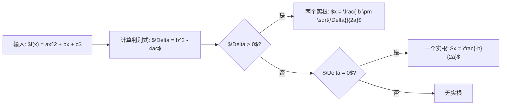

# KaTeX 和 Mermaid 测试

本文用于测试 KaTeX 数学公式渲染和 Mermaid 图表功能。

## Mermaid 图表测试

### 流程图

### 序列图

### 甘特图

## KaTeX 测试

### 行内公式

这是一个行内公式：$E = mc^2$，爱因斯坦的质能等价公式。

另一个例子：当 $a \neq 0$ 时，二次方程 $ax^2 + bx + c = 0$ 的解为 $x = \frac{-b \pm \sqrt{b^2-4ac}}{2a}$。

### 块级公式
#### 二次公式
$$x = \frac{-b \pm \sqrt{b^2-4ac}}{2a}$$

#### 欧拉公式
$$e^{i\pi} + 1 = 0$$

#### 积分公式
$$\int_{-\infty}^{\infty} e^{-x^2} dx = \sqrt{\pi}$$

#### 矩阵表示
$$\begin{pmatrix} a & b \\ c & d \end{pmatrix} \begin{pmatrix} x \\ y \end{pmatrix} = \begin{pmatrix} ax + by \\ cx + dy \end{pmatrix}$$

#### 求和公式
$$\sum_{n=1}^{\infty} \frac{1}{n^2} = \frac{\pi^2}{6}$$

#### 微分方程
$$\frac{d^2y}{dx^2} + \omega^2 y = 0$$

#### 傅里叶变换
$$F(\omega) = \int_{-\infty}^{\infty} f(t) e^{-i\omega t} dt$$

#### 泰勒级数
$$f(x) = \sum_{n=0}^{\infty} \frac{f^{(n)}(a)}{n!}(x-a)^n$$

### 复杂数学表达式

#### 概率密度函数
$$f(x) = \frac{1}{\sigma\sqrt{2\pi}} e^{-\frac{1}{2}\left(\frac{x-\mu}{\sigma}\right)^2}$$

#### 麦克斯韦方程组
$$\begin{align}
\nabla \cdot \mathbf{E} &= \frac{\rho}{\epsilon_0} \\
\nabla \cdot \mathbf{B} &= 0 \\
\nabla \times \mathbf{E} &= -\frac{\partial \mathbf{B}}{\partial t} \\
\nabla \times \mathbf{B} &= \mu_0\mathbf{J} + \mu_0\epsilon_0\frac{\partial \mathbf{E}}{\partial t}
\end{align}$$

#### 薛定谔方程
$$i\hbar\frac{\partial}{\partial t}\Psi(\mathbf{r},t) = \hat{H}\Psi(\mathbf{r},t)$$

## 组合测试

### 带公式的流程图

### 数学概念解释

在数学中，**黄金比例** $\phi$ 定义为：

$$\phi = \frac{1 + \sqrt{5}}{2} \approx 1.618$$

它满足以下性质：

$$\phi^2 = \phi + 1$$

这个比例在自然界和艺术中都有广泛应用。

---

这个测试页面展示了 KaTeX 和 Mermaid 的各种功能，包括复杂的数学公式和多种类型的图表。
